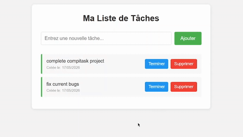

# To-Do List App



## What is this?

A simple web app to manage a to-do list. You can add tasks, delete them, and mark them as done. Everything saves automatically to your browser so nothing gets lost when you close the tab.

Built as a first web project to learn the basics of HTML, CSS, and JavaScript.

---

## How to use it

1. Open `index.html` in your browser
2. Type a task and click "Add" (or just press Enter)
3. Click "Done" to check off a task
4. Click "Delete" to remove it

That's it. Your tasks are still there when you come back.

---

## Project files

### `index.html`
The structure of the page — the title, input field, button, and the task list itself.

### `style.css`
All the styling. Colors, layout, making it work on mobile.

### `script.js`
The JavaScript that makes everything actually work — adding tasks, deleting them, saving them.

---

## What I used to build it

### HTML — Structure
- `<input>` for typing a task
- `<button>` to submit it
- `<ul>` and `<li>` to display the list
- `id` attributes so JavaScript can find the right elements

### CSS — Design
- Simple color scheme (green for done, red for delete, blue for add)
- Flexbox to align everything cleanly
- Responsive layout so it works on phone too

### JavaScript — Logic
- Functions for adding, deleting, and completing tasks
- `addEventListener` to react to button clicks and Enter key presses
- `localStorage` to save tasks in the browser so they persist between sessions

---

## File structure

```
📁 Project
  ├─ index.html
  ├─ style.css
  ├─ script.js
  └─ 📁 assets
      └─ demo.gif
```

All 3 files need to be in the same folder or the CSS and JS won't load.

---

## Resources I used

- HTML Basics — W3Schools: https://www.w3schools.com/Html/html_basic.asp
- JavaScript Reference — W3Schools: https://www.w3schools.com/jsref/default.asp
- HTML and CSS for Beginners (YouTube): https://www.youtube.com/playlist?list=PL0eyrZgxdwhwNC5ppZo_dYGVjerQY3xYU
- JavaScript Crash Course (beginner): https://www.youtube.com/watch?v=PkZNo7MFNFg

---

*First web project — built to learn HTML, CSS, and JavaScript from scratch.*
